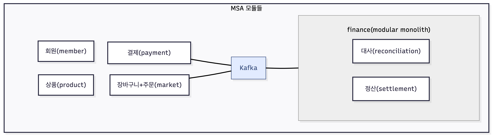

# beadv4_4_Refactoring_BE
백엔드 단기 심화 4기 Refactoring 팀의 BE 레포지토리입니다.

# 키보드 마니아를 위한 키보드 이커머스 플랫폼

> **Project Status:** 🚧 [리팩토링 및 고도화 진행중]
> 
> **Latest Update:** [dev 브랜치 확인해주세요]

## 1. 프로젝트 소개 (Overview)
MSA 아키텍처 기반의 이커머스 플랫폼입니다.
주문, 결제, 정산, 회원 서비스가 유기적으로 연동되며, 대용량 트래픽 환경에서의 **데이터 정합성**과 **시스템 안정성**을 목표로 합니다.

## 2. 전체 아키텍처 (Architecture)

## 3. 팀원 및 담당 역할 (Team Members)
| 이름  |   담당 모듈    | 주요 역할                            |
|:---:|:----------:|:---------------------------------|
| 노승억 | Settlement | 정산/대사 시스템 설계, 데이터 정합성 검증 로직 구현   |
| 엄상현 |   Member   | 회원 인증/인가 (JWT, OAuth2), 상품 로직 구현 |
| 이현종 |  Product   | 회원 지갑 관리 및 PG사 연동 로직 구현          |
| 양상훈 |   Order    | 주문 처리 및 장바구니 로직 구현               |

## 4. 기술적 도전 및 고도화 계획

### 데이터 정합성 보장을 위한 대사 시스템
> **Problem:** 분산 환경(MSA)에서 PG사 결제 내역과 내부 주문 데이터 간 불일치 발생 위험
> **Solution:** 3-Step(누락/금액) 검증 엔진 및 자동 보정 배치 구현
> **Code:** [👉 정산/대사 검증 로직 보러가기](https://github.com/prgrms-be-adv-devcourse/beadv4_4_Refactoring_BE/tree/dev/settlement-service/src/main/java/com/thock/back/settlement/reconciliation)
> 
> **Test:** [👉 정산/대사 검증 테스트 보러가기](https://github.com/prgrms-be-adv-devcourse/beadv4_4_Refactoring_BE/blob/dev/settlement-service/src/test/java/com/thock/back/settlement/reconciliation/app/UseCase/RunReconciliationUseCaseTest.java)
>
>
### 멱등성(Idempotency) 보장 전략
> **Challenge:** 네트워크 불안정으로 인한 재시도(Retry) 발생 시, 동일한 정산 요청이 중복 처리될 위험 존재.
> **Plan:** 요청 고유 ID와 처리 결과 ID를 매핑하는 **Idempotency Key 테이블**을 도입하여, 동일한 요청이 여러 번 들어와도 **'최초 1회만 처리'**되도록 보장할 예정입니다.

### 대용량 데이터 처리
> **Challenge:** JPA `saveAll()` 사용 시, 영속성 컨텍스트(Dirty Checking) 관리 비용과 Identity 전략 한계로 인한 대량 Insert 성능 저하.
> **Plan:** **JDBC Template Batch Update**를 도입하여 JPA를 우회, 쿼리를 하나로 묶어 전송(Batch Insert)함으로써 대량 데이터 적재 속도를 획기적으로 개선할 계획입니다.
> 
### 동시성 제어(예정)
> **Problem:** 정산 지급 시 중복 요청에 의한 자산 손실 위험
> 
> **Solution:** 비관적 락을 적용하여 데이터 무결성 보장

## 5. 기술 스택 (Tech Stack)
- **Backend:** Java 17, Spring Boot 3.4.1, JPA
- **Infra:** Docker, MySQL, Redis, Kafka